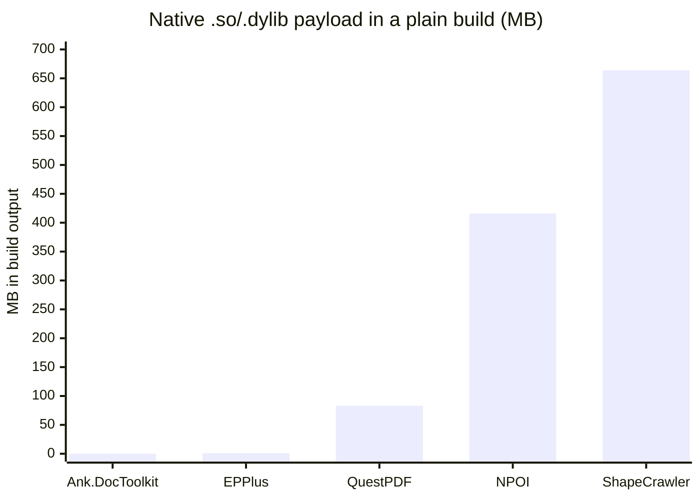

# DocToolkit

[](https://github.com/Ank-KhoaHo/DocToolkit/actions/workflows/ci.yml)
[](https://codecov.io/gh/Ank-KhoaHo/DocToolkit)
[](https://www.nuget.org/packages/Ank.DocToolkit/)
[](https://www.nuget.org/packages/Ank.DocToolkit/)
[](https://www.nuget.org/packages/Ank.DocToolkit.Extensions.DependencyInjection/)

**Convert HTML to PDF in C# — without a headless browser.** Pure managed code: no native
binaries, no browser, no LibreOffice, no Office interop. Runs on Linux, macOS, Windows and arm64,
and makes **no network calls at runtime**.

<!-- BEGIN GENERATED (scripts/gen-capability-matrix.py) - do not edit by hand -->

| From ↓ / To → | CSV | DOC | DOCX | HTML | Markdown | PDF | PPTX | XLSX |
|---|---|---|---|---|---|---|---|---|
| **CSV** | — | · | · | · | · | · | · | · |
| **DOC** | · | — | **✅** | · | · | · | · | · |
| **DOCX** | · | · | — | **✅** | **✅** | **✅** | · | · |
| **HTML** | · | · | **✅** | — | · | **✅** | · | · |
| **Markdown** | · | · | **✅** | · | — | **✅** | · | · |
| **PDF** | · | · | · | · | · | — | · | · |
| **PPTX** | · | · | · | · | · | **✅** | — | · |
| **XLSX** | **✅** | · | · | **✅** | · | **✅** | · | — |

A **✅** is a converter that ships; **·** is a pair with no converter, not a promise about one. Read a row as "from this format, into these".

<!-- END GENERATED -->

Generated from the shipped API, not written by hand — [full grid, plus every edit/read
operation](https://ank-khoaho.github.io/DocToolkit/guides/capabilities.html). Also: open, edit and
**password-protect** DOCX, XLSX and PPTX, and read PDF text.

```bash
dotnet add package Ank.DocToolkit
```

<!-- BEGIN SNIPPET: readme-quickstart -->

```csharp
// HTML in, a Word document and a PDF out. No browser, no LibreOffice, nothing to install.
byte[] docx = await HtmlToDocxConverter.ConvertAsync("<h1>Invoice 2026-114</h1>");
byte[] pdf = await HtmlToPdfConverter.ConvertAsync("<h1>Invoice 2026-114</h1>");

// Read a document back, edit one you were given, and lock it when you are done.
string text = DocxEditor.ExtractText(docx);
byte[] locked = PdfEditor.Protect(pdf, new PdfProtection { UserPassword = "s3cret" });
```

<!-- END SNIPPET -->

Targets `net8.0` and `net10.0`. MIT licensed.

📖 [Guides](https://ank-khoaho.github.io/DocToolkit/guides/) ·
🔎 [API reference](https://ank-khoaho.github.io/DocToolkit/) · 🗺️ [Roadmap](ROADMAP.md) · 📦
[package README](src/DocToolkit/README.md) · 📝 [CHANGELOG](CHANGELOG.md)

> **Contributing?** Branch from `main` and open a pull request back into it — `main` itself cannot
> be pushed directly. See [CONTRIBUTING.md](CONTRIBUTING.md) for the build, the commit-message
> rules, and the four constraints that will get a pull request rejected.

## Measured against the alternatives

Most .NET document stacks fail one of three things: a licence with a revenue threshold, a native
binary that breaks on Linux, or a claim nobody re-checked. This package is built to fail none of
them, and the numbers below are how that gets verified rather than asserted.



| package | native `.so`/`.dylib` in build output | `runtimes/` | licence in NuGet metadata |
|---|---|---|---|
| **Ank.DocToolkit** | **0** | **0 MB** | **`MIT`**, as an SPDX expression |
| EPPlus | 0 | 1 MB | ships `license.md` — read it |
| QuestPDF | 10 | 83 MB | ships `LICENSE.md` — read it |
| NPOI | 12 | 416 MB | ships `OSMFEULA.txt` — read it |
| ShapeCrawler | 19 | 664 MB | none declared |

Every number was measured on 2026-08-09 by adding the package to an empty `net8.0` console app and
building it. **Reproduce any row in under a minute** — that is the point of publishing the method
rather than a conclusion:

```bash
dotnet new console && dotnet add package <name> && dotnet build -c Release
find bin -path '*runtimes*' \( -name '*.so' -o -name '*.dylib' \) | wc -l
du -sm bin/Release/net8.0/runtimes
```

**Two things this table deliberately does not do.** It does not tell you what those licences say —
they are linked from each package's own page and are the authors' to describe, not ours. And it does
not claim native payload is everyone's problem: **EPPlus carries essentially none**, so if that is
your only concern it is not a reason to switch. Where the payload does appear it comes from
SkiaSharp and Magick.NET, pulled in transitively for image rendering.

What the table is for is the case where **both** columns matter at once — a Linux container that has
to stay small, with a licence you can clear without asking anybody. That combination is the whole
reason this package exists, and all four constraints below are re-checked by CI on every push.

## What it does

| | |
|---|---|
| **Convert** | HTML and Markdown to DOCX and PDF; DOCX to HTML, Markdown and PDF; XLSX to CSV, HTML and PDF; PPTX to PDF; legacy Word 97-2003 `.doc` to DOCX; legacy PowerPoint 97-2003 `.ppt` to PDF ([at a measured rate](https://ank-khoaho.github.io/DocToolkit/guides/capabilities.html#legacy-binary-formats-which-the-grid-above-does-not-show)) |
| **Edit** | create and edit DOCX, XLSX and PPTX; fill templates, including one row per record; insert images; read text back out |
| **PDF** | page count, merge, split, extract, rotate, reorder, insert; read text; read and stamp document information |
| **Protect** | password-protect and unprotect PDF, DOCX, XLSX and PPTX |

The full grid is generated from the shipped API rather than written by hand:
**[what it can convert](https://ank-khoaho.github.io/DocToolkit/guides/capabilities.html)**.

Task-shaped walkthroughs, one per format, live in the
**[guides](https://ank-khoaho.github.io/DocToolkit/guides/)** — start at
[Getting started](https://ank-khoaho.github.io/DocToolkit/guides/getting-started.html) for the
install-to-first-conversion path, or jump straight to the page for the format you need.

## Why this exists

Most .NET document stacks fail at least one of these. This one satisfies all four:

| Constraint | How |
|---|---|
| **Free for commercial use** | 30 dependencies: 28 MIT, 2 Apache-2.0. No revenue thresholds, no per-seat fees. |
| **NuGet only** | No Chromium download, no LibreOffice install, no native binaries. |
| **Targets `net8.0` and `net10.0`** | Two LTS targets, one public API surface. `net9.0` is deliberately absent — a `net9.0` app already consumes the `net8.0` build, so it would add no reach. `netstandard2.0` is deliberately absent too: every dependency supports it, but the bounded-fetch guarantee on remote images cannot be expressed there, and `DateOnly`/`TimeOnly` would make the API differ per target. |
| **Runs everywhere .NET does** | The full suite runs in CI on Linux, Windows, macOS and **arm64** (`ubuntu-24.04` x64, `windows-latest`, `macos-latest` Apple Silicon, `ubuntu-24.04-arm`). Not inferred from "pure managed" - measured on each. |
| **Works offline** | No runtime network I/O. Proven by 40 air-gap tests. |

All four are properties of the *resolved dependency graph*, so a single upstream bump can break
them silently — which is why CI re-checks every one on every push.

**That has happened once already.** PowerPoint support originally used ShapeCrawler, whose *API*
was checked and whose *dependencies* were not. It pulls in SkiaSharp and Magick.NET, which put
**38 native `.so`/`.dylib` files and 664 MB of `runtimes/`** into build output — breaking two of
the four constraints at once, on a package that restored and built perfectly well. It was replaced
with raw `DocumentFormat.OpenXml`, and the check that would have caught it now runs on every push.
The [comparison table](#measured-against-the-alternatives) above is the same measurement, applied
to the alternatives.

### Trust, verification and limits

| | |
|---|---|
| **Trimmable / native AOT** | Both packages marked, and both **run-tested** in CI — not just published warning-free. One caveat: ClosedXML emits trim warning `IL2090`. → [Trimming and native AOT](https://ank-khoaho.github.io/DocToolkit/guides/production.html#trimming-and-native-aot) |
| **Provenance attestation** | Every `.nupkg` and SBOM is signed, naming the workflow, commit and runner. → [Verifying a release](https://ank-khoaho.github.io/DocToolkit/guides/production.html#verifying-a-release) |
| **SBOM** | CycloneDX per package, attached to every [GitHub Release](https://github.com/Ank-KhoaHo/DocToolkit/releases) |
| **Offline, enforced not intended** | 40 guard tests assert **zero** socket connections against 16 ways markup can name a host; mutation-tested weekly. → [Nothing reaches the network unless you ask](https://ank-khoaho.github.io/DocToolkit/guides/production.html#nothing-reaches-the-network-unless-you-ask) |
| **Fidelity, on real files** | 88–98% success across 500+ real `.gov` documents, monthly. → [Measured on documents nobody here wrote](https://ank-khoaho.github.io/DocToolkit/guides/capabilities.html#measured-on-documents-nobody-here-wrote) |
| **What this won't do** | CSS layout, mixed page setups, multi-line headers — the bounded list. → [Known limitations](https://ank-khoaho.github.io/DocToolkit/guides/production.html#what-this-library-will-not-do) |

Offline is the default everywhere; remote images are the one opt-in, and it stays bounded rather
than wide open:

<!-- BEGIN SNIPPET: readme-remote-opt-in -->

```csharp
byte[] docx = await HtmlToDocxConverter.ConvertAsync(html, allowRemoteImageDownload: true);

// Bounded instead of wide open: timeout, byte cap, host allow-list and a block on
// loopback/private/link-local addresses, all on by default. Not a complete SSRF defence — see
// the package README.
byte[] bounded = await HtmlToDocxConverter.ConvertAsync(html, new RemoteImageOptions());
```

<!-- END SNIPPET -->

## Documentation

The **[package README](src/DocToolkit/README.md)** is the reference: every capability, every
overload, and the caveats that matter. It is also what nuget.org renders, so it is what you get on
the package page.

| | |
|---|---|
| **[Guides](https://ank-khoaho.github.io/DocToolkit/guides/getting-started.html)** | Task-shaped walkthroughs - getting started, HTML, Markdown, Word, spreadsheets, DI, production |
| **[API reference](https://ank-khoaho.github.io/DocToolkit/)** | Generated from the source |
| **[Samples](samples/)** | One runnable project per capability, each answering one question, built against the published packages |
| **[Package README](src/DocToolkit/README.md)** | Full usage, page setup, passwords, telemetry, known limitations, and the migration notes per release |
| **[Extensions README](src/DocToolkit.Extensions.DependencyInjection/README.md)** | `services.AddDocToolkit()` and the injectable interfaces |
| **[CHANGELOG](CHANGELOG.md)** | What changed, per release |
| **[PUBLIC.md](PUBLIC.md)** | Why the design docs, ADRs and backlog are **not** in your clone, and what would have to change for them to be |
| **[CONTRIBUTING](CONTRIBUTING.md)** | Build, test, commit rules, repository layout, and the four constraints a pull request must not break |
| **[SECURITY](SECURITY.md)** | Reporting a vulnerability, the scope, and the documented limits that are not findings |

## Licence

MIT — see [LICENSE](LICENSE).

---

If this replaced a headless browser in your build, a star helps others find it — GitHub's
repository search ranks partly on stars, and this one has three.
