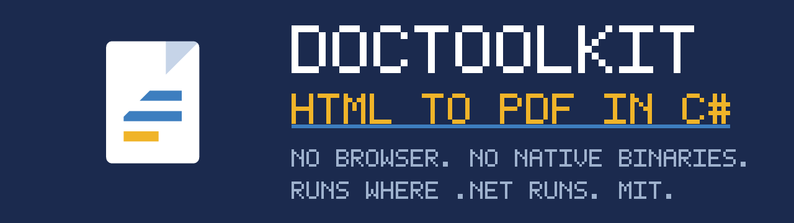

# DocToolkit

[](https://github.com/Ank-KhoaHo/DocToolkit/actions/workflows/ci.yml)
[](https://codecov.io/gh/Ank-KhoaHo/DocToolkit)
[](https://www.nuget.org/packages/Ank.DocToolkit/)
[](https://www.nuget.org/packages/Ank.DocToolkit/)
[](https://www.nuget.org/packages/Ank.DocToolkit.Extensions.DependencyInjection/)

**A C# library to convert HTML to PDF without a headless browser** — plus Markdown → DOCX/PDF,
**DOCX → HTML/Markdown/PDF**, **XLSX → CSV/HTML/PDF**, **PPTX → PDF**, legacy **.doc**, PDF text, and open/edit/**password-protect**
for **DOCX, XLSX and PPTX**. **Pure managed** — no native binaries, no browser, no LibreOffice, no Office
interop; runs on Linux, macOS, Windows and arm64, and makes **no network calls at runtime**.

```bash
dotnet add package Ank.DocToolkit
```

<!-- BEGIN SNIPPET: readme-quickstart -->

```csharp
// HTML in, a Word document and a PDF out. No browser, no LibreOffice, nothing to install.
byte[] docx = await HtmlToDocxConverter.ConvertAsync("<h1>Invoice 2026-114</h1>");
byte[] pdf = await HtmlToPdfConverter.ConvertAsync("<h1>Invoice 2026-114</h1>");

// Read a document back, edit one you were given, and lock it when you are done.
string text = DocxEditor.ExtractText(docx);
byte[] locked = PdfEditor.Protect(pdf, new PdfProtection { UserPassword = "s3cret" });
```

<!-- END SNIPPET -->

Targets `net8.0` and `net10.0`. MIT licensed.

📖 [Guides](https://ank-khoaho.github.io/DocToolkit/guides/getting-started.html) ·
🔎 [API reference](https://ank-khoaho.github.io/DocToolkit/) · 🗺️ [Roadmap](ROADMAP.md) · 📦
[package README](src/DocToolkit/README.md) · 📝 [CHANGELOG](CHANGELOG.md)

> **Contributing?** Branch from `main` and open a pull request back into it — `main` itself cannot
> be pushed directly. See [CONTRIBUTING.md](CONTRIBUTING.md) for the build, the commit-message
> rules, and the four constraints that will get a pull request rejected.

## Why this exists

Most .NET document stacks fail at least one of these. This one satisfies all four:

| Constraint | How |
|---|---|
| **Free for commercial use** | 30 dependencies: 28 MIT, 2 Apache-2.0. No revenue thresholds, no per-seat fees. |
| **NuGet only** | No Chromium download, no LibreOffice install, no native binaries. |
| **Targets `net8.0` and `net10.0`** | Two LTS targets, one public API surface. `net9.0` is deliberately absent — a `net9.0` app already consumes the `net8.0` build, so it would add no reach. `netstandard2.0` is deliberately absent too: every dependency supports it, but the bounded-fetch guarantee on remote images cannot be expressed there, and `DateOnly`/`TimeOnly` would make the API differ per target. |
| **Runs everywhere .NET does** | The full suite runs in CI on Linux, Windows, macOS and **arm64** (`ubuntu-24.04` x64, `windows-latest`, `macos-latest` Apple Silicon, `ubuntu-24.04-arm`). Not inferred from "pure managed" - measured on each. |
| **Works offline** | No runtime network I/O. Proven by 40 air-gap tests. |

All four are properties of the *resolved dependency graph*, so a single upstream bump can break
them silently — which is why CI re-checks every one on every push.

**That has happened once already.** PowerPoint support originally used ShapeCrawler, whose *API*
was checked and whose *dependencies* were not. It pulls in SkiaSharp and Magick.NET, which put
**38 native `.so`/`.dylib` files and 664 MB of `runtimes/`** into build output — breaking two of
the four constraints at once, on a package that restored and built perfectly well. It was replaced
with raw `DocumentFormat.OpenXml`, and the check that would have caught it now runs on every push.
The [comparison table](#measured-against-the-alternatives) below is the same measurement, applied
to the alternatives.

### Trimming and native AOT

Both packages are marked `IsTrimmable`, and the core package is marked `IsAotCompatible`.

That claim is checked the same way as the four above — CI trim-publishes an application over the
real dependency graph, then **runs it** and asserts every capability still works. A trim failure
does not appear at publish time: the trimmer removes a type something looks up by name, and the app
throws, or quietly produces an empty document, in production.

One caveat that is a dependency's rather than ours: **ClosedXML emits a trim warning**
(`IL2090`, in `DescribedEnumParser<T>`). Spreadsheet reading and writing work correctly in the
trimmed app CI runs, but the warning will appear in your publish output.

**Native AOT is claimed, and earned the same way.** `IsAotCompatible` is a strictly stronger
promise than `IsTrimmable` — it additionally forbids runtime code generation — and this README said
it was *not* claimed for as long as that was true. It changed on 2026-08-14 when a second CI job
started native-AOT-publishing the same probe and running it. Measured on that run: DOCX create and
read-back, placeholder replacement, PPTX, XLSX, HTML → DOCX, DOCX → PDF and PDF → text all correct,
including PdfPig's CMap handling and the font work, which are the two most reflection-dependent
paths in the graph.

The ClosedXML `IL2090` caveat above applies to an AOT publish too, for the same reason and with the
same outcome.

### Verifying what you downloaded

Every published `.nupkg` carries a signed **build provenance attestation** naming the workflow, the
commit and the runner that produced it. To check a package really came from this repository's CI
rather than someone's laptop:

```bash
gh attestation verify Ank.DocToolkit.<version>.nupkg --repo Ank-KhoaHo/DocToolkit
```

Attestation is produced immediately before the push, so the bytes that are verified are the bytes
that were published.

**The packages are not code-signed.** Authenticode signing needs a code-signing certificate this
project does not hold; provenance attestation answers "did this come from that source" without one,
which is the question a consumer of an open-source package usually has.

### The SBOM

Each release attaches a **CycloneDX SBOM** per package to its
[GitHub Release](https://github.com/Ank-KhoaHo/DocToolkit/releases) —
`DocToolkit.cdx.json` and `DocToolkit.Extensions.DependencyInjection.cdx.json`.

It is the machine-readable counterpart to `THIRD-PARTY-NOTICES.txt`: that file is for a human
meeting a licence question, this is for a scanner answering "am I exposed to CVE-X" without
resolving the graph itself. The core package's BOM lists 30 packages: 28 MIT, 2 Apache-2.0 — the
same closure the constraints table states above, derived independently.

(Phrased that way on purpose. `gen-third-party-notices.py` verifies README package counts against
the resolved graph, but only where they are written as "N packages: N MIT, N Apache-2.0". This
sentence used to read "29 components, 28 MIT and one Apache-2.0", which escaped the pattern on all
three counts — so it stayed stale through the release that added PdfPig while the check reported
success. A claim worth checking is worth phrasing the way the checker reads.)

**The SBOMs are attested too**, by the same provenance step as the packages. An SBOM that is merely
attached to a release is a file anyone with write access could replace; attested, it carries proof
it came from this workflow and this commit, which is what makes it worth reading.

```bash
gh attestation verify DocToolkit.cdx.json --repo Ank-KhoaHo/DocToolkit
```

**Its content is reproducible; the file is not.** Generation is run with `--no-serial-number`, so
the random per-run UUID is gone and exactly one field varies between two runs over an identical
graph — `metadata.timestamp`. To check a published SBOM against a regenerated one, drop it:

```bash
dotnet tool restore
dotnet dotnet-CycloneDX src/DocToolkit/DocToolkit.csproj -o . -fn regenerated.cdx.json   --json --no-serial-number --exclude-dev

diff <(jq 'del(.metadata.timestamp)' DocToolkit.cdx.json)      <(jq 'del(.metadata.timestamp)' regenerated.cdx.json)
```

## Measured against the alternatives

Every number below was measured on 2026-08-09 by adding the package to an empty `net8.0` console
app and building it. **Reproduce any row in under a minute** — that is the point of publishing the
method rather than a conclusion:

```bash
dotnet new console && dotnet add package <name> && dotnet build -c Release
find bin -path '*runtimes*' \( -name '*.so' -o -name '*.dylib' \) | wc -l
du -sm bin/Release/net8.0/runtimes
```

| package | native `.so`/`.dylib` in build output | `runtimes/` | licence in NuGet metadata |
|---|---|---|---|
| **Ank.DocToolkit** | **0** | **0 MB** | **`MIT`**, as an SPDX expression |
| EPPlus | 0 | 1 MB | ships `license.md` — read it |
| QuestPDF | 10 | 83 MB | ships `LICENSE.md` — read it |
| NPOI | 12 | 416 MB | ships `OSMFEULA.txt` — read it |
| ShapeCrawler | 19 | 664 MB | none declared |

**Two things this table deliberately does not do.** It does not tell you what those licences say —
they are linked from each package's own page and are the authors' to describe, not ours. And it does
not claim native payload is everyone's problem: **EPPlus carries essentially none**, so if that is
your only concern it is not a reason to switch. Where the payload does appear it comes from
SkiaSharp and Magick.NET, pulled in transitively for image rendering.

What the table is for is the case where **both** columns matter at once — a Linux container that has
to stay small, with a licence you can clear without asking anybody. That combination is the whole
reason this package exists, and all four constraints are re-checked by CI on every push.

## Fidelity, measured on documents nobody here wrote

Most conversion libraries tell you what they support. This one tells you **how often it works on
files it has never seen**, because a test suite proves only that a library agrees with itself —
every fixture in this repository was produced by the code under test.

So the conversions are run against **[govdocs1](https://digitalcorpora.org/corpora/file-corpora/files/)**,
a public crawl of real `.gov` documents, by
[`corpus.yml`](.github/workflows/corpus.yml). Measured on chunk `000`, 2026-08-20:

| conversion | succeeded | of |
|---|---|---|
| HTML → DOCX | **97.8%** | 181 real pages |
| legacy `.doc` → DOCX | **89.2%** | 111 real documents |
| HTML → PDF | **88.4%** | 181 real pages |

Reading PDFs is separate and stronger: over **200 real PDFs — 4,588 pages from a dozen producers —
every operation succeeded on every file it did not refuse**, and the only refusals were 11
permission-restricted documents, reported as exactly that. Text extraction returned text for 198 of
200; the two exceptions have no text layer to extract.

**These numbers are published because they are unflattering and still useful.** HTML → PDF began
well below where it is now and improved by fixing what the corpus exposed, not by changing how it
was counted. The workflow is scheduled monthly, so the figures move on their own and can be checked
against a run rather than taken on trust.

**What is deliberately not in that table.** The corpus predates both `.pptx` and `.docx`, so there
is no measured **PPTX → PDF** or **DOCX → PDF** rate here — govdocs1 chunk `000` contains neither
format, so there is nothing real to measure them on. Quoting the legacy `.ppt` figure in place of a
PPTX rate would be measuring one thing and labelling it another, and chaining `.doc` → DOCX → PDF
to manufacture a DOCX → PDF figure would be the same substitution: it measures the chain, so a
failure could belong to either stage. The legacy `.ppt` figure has a section of its own instead.

### Legacy PowerPoint 97-2003

`PptxToPdfConverter.Convert` also reads **binary `.ppt` decks**, the format PowerPoint used before
2007. No separate call: hand it the bytes.

**It succeeds on 60.2% of them** — measured over the 88 genuine legacy decks in govdocs1 chunk
`000`, producing 988 pages, 51 of 53 carrying extractable text. **That is a lower bar than the
OOXML path and is stated rather than rounded up to "supported".**

The refusals are not random, which is what makes the number usable. Twenty of the thirty-five are
one upstream limitation — a shape group with no drawable child. Nine are text-encoding failures,
the same family a font can fix elsewhere in this package. Five are control characters in the deck's
own text. **None produced a corrupt PDF**; every failure was a clean refusal.

So: worth trying on an archive of old decks, and worth checking the result rather than assuming it.
If a deck is refused, converting it once in PowerPoint remains the reliable route.

## What it does

| | |
|---|---|
| **Convert** | HTML and Markdown to DOCX and PDF; DOCX to HTML, Markdown and PDF; XLSX to CSV, HTML and PDF; PPTX to PDF; legacy Word 97-2003 `.doc` to DOCX; legacy PowerPoint 97-2003 `.ppt` to PDF ([at a measured rate](#legacy-powerpoint-97-2003)) |
| **Edit** | create and edit DOCX, XLSX and PPTX; fill templates, including one row per record; insert images; read text back out |
| **PDF** | page count, merge, split, extract, rotate, reorder, insert; read text; read and stamp document information |
| **Protect** | password-protect and unprotect PDF, DOCX, XLSX and PPTX |

The full grid is generated from the shipped API rather than written by hand:
**[what it can convert](https://ank-khoaho.github.io/DocToolkit/guides/capabilities.html)**.

## Offline by default

No default code path performs network I/O — enforced, not merely intended. 40 guard tests assert
**zero** socket connections across the whole public API, against markup naming a loopback listener
sixteen ways (``, `srcset`, `<link rel=stylesheet>`, `@import`, `background-image`,
`<iframe>`, `<object>`, `<script>`). The guard is proved by mutation: enabling downloads turns nine
of those tests red with real request lines, so it discriminates rather than passing vacuously.

`MarkdownToDocxConverter` takes the same stance and is measured the same way: an image URL in
Markdown becomes a **hyperlink rather than a fetch**, a local file reference is **refused** (a path
in untrusted content would let the document choose which file lands in the output), and `data:`
images are inlined because they carry their own bytes. Its zero-connection test ships with a
positive control, so it cannot pass because the probe stopped working.
**That proof is re-earned weekly rather than asserted** — Stryker.NET mutates the guard-critical
files in CI and fails if the mutation score drops (74.3% when the gate was added).

The one exception is explicit and opt-in, and **is silently image-less in an air-gapped
environment** — an unreachable host is skipped, not fatal:

<!-- BEGIN SNIPPET: readme-remote-opt-in -->

```csharp
byte[] docx = await HtmlToDocxConverter.ConvertAsync(html, allowRemoteImageDownload: true);

// Bounded instead of wide open: timeout, byte cap, host allow-list and a block on
// loopback/private/link-local addresses, all on by default. Not a complete SSRF defence — see
// the package README.
byte[] bounded = await HtmlToDocxConverter.ConvertAsync(html, new RemoteImageOptions());
```

<!-- END SNIPPET -->

## Documentation

The **[package README](src/DocToolkit/README.md)** is the reference: every capability, every
overload, and the caveats that matter. It is also what nuget.org renders, so it is what you get on
the package page.

| | |
|---|---|
| **[Guides](https://ank-khoaho.github.io/DocToolkit/guides/getting-started.html)** | Task-shaped walkthroughs - getting started, HTML, Markdown, Word, spreadsheets, DI, production |
| **[API reference](https://ank-khoaho.github.io/DocToolkit/)** | Generated from the source |
| **[Samples](samples/)** | One runnable project per capability, each answering one question, built against the published packages |
| **[Package README](src/DocToolkit/README.md)** | Full usage, page setup, passwords, telemetry, known limitations, and the migration notes per release |
| **[Extensions README](src/DocToolkit.Extensions.DependencyInjection/README.md)** | `services.AddDocToolkit()` and the injectable interfaces |
| **[CHANGELOG](CHANGELOG.md)** | What changed, per release |
| **[PUBLIC.md](PUBLIC.md)** | Why the design docs, ADRs and backlog are **not** in your clone, and what would have to change for them to be |
| **[CONTRIBUTING](CONTRIBUTING.md)** | Build, test, commit rules, repository layout, and the four constraints a pull request must not break |
| **[SECURITY](SECURITY.md)** | Reporting a vulnerability, the scope, and the documented limits that are not findings |

## Licence

MIT — see [LICENSE](LICENSE).

---

If this replaced a headless browser in your build, a star helps others find it — GitHub's
repository search ranks partly on stars, and this one has three.
